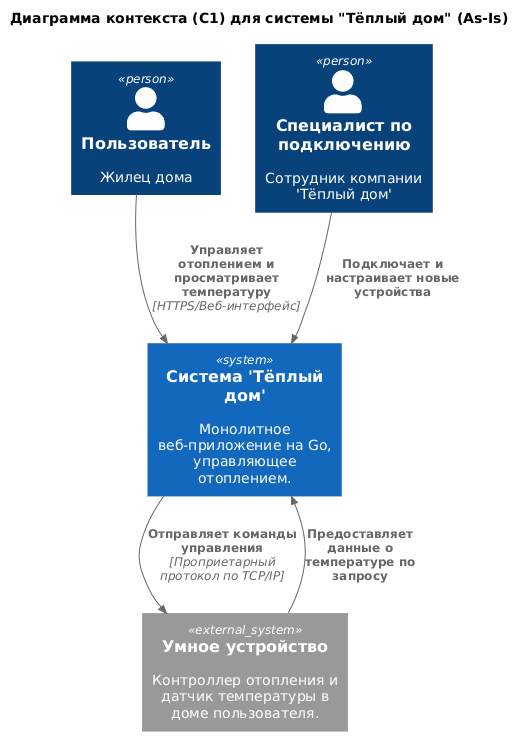
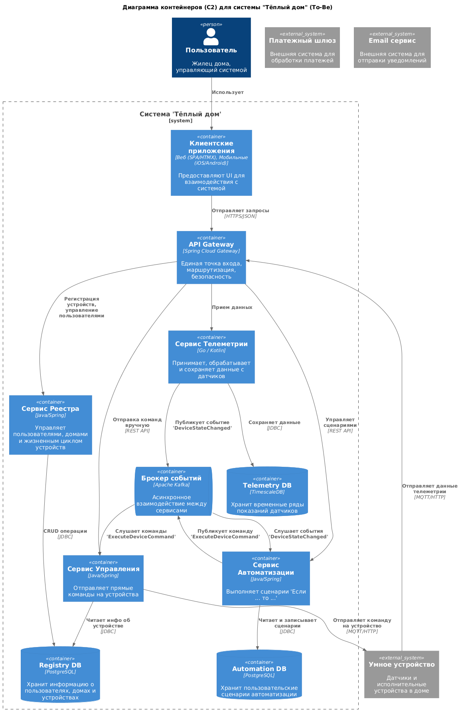
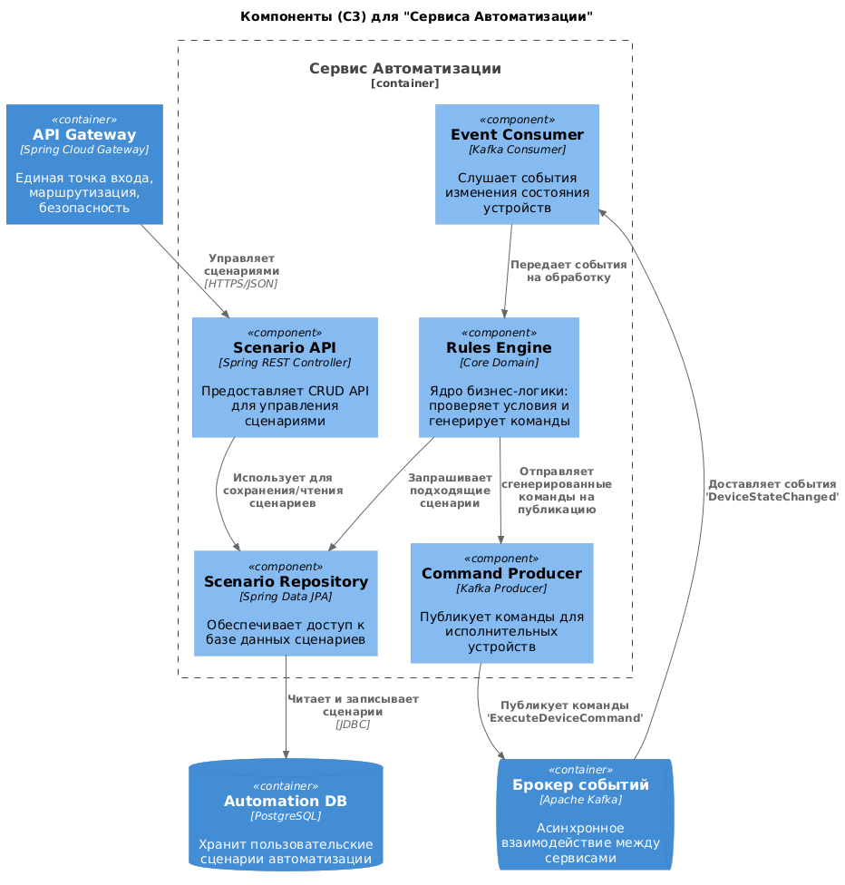
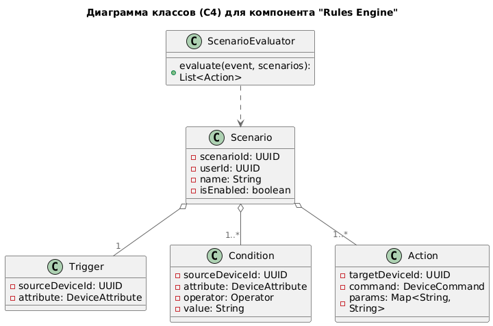
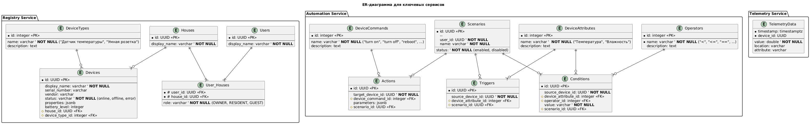

# Project_template

Это шаблон для решения проектной работы. Структура этого файла повторяет структуру заданий. Заполняйте его по мере работы над решением.

# Задание 1. Анализ и планирование

<aside>

Чтобы составить документ с описанием текущей архитектуры приложения, можно часть информации взять из описания компании и условия задания. Это нормально.

</aside

### 1. Описание функциональности монолитного приложения

**Управление отоплением:**

- Пользователи могут удаленно управлять системой отопления в своем доме через веб-интерфейс.
- Система поддерживает отправку команд на включение, выключение и, возможно, регулировку мощности отопительного оборудования.
- Все команды отправляются с сервера на конечное устройство по инициативе сервера.

**Мониторинг температуры:**

- Пользователи могут просматривать текущую температуру в доме через веб-интерфейс.
- Система получает данные о температуре путем периодического опроса датчиков со стороны сервера.
- Подключение новых устройств (датчиков и контроллеров отопления) к системе выполняется техническим специалистом компании, самостоятельное подключение пользователем не поддерживается.

### 2. Анализ архитектуры монолитного приложения

Текущая система "Тёплый дом" представляет собой классическое монолитное приложение со следующими архитектурными характеристиками:

- **Технологический стек:** Приложение разработано на языке **Go**. В качестве системы управления базами данных используется **PostgreSQL**.

- **Архитектурный стиль:** **Монолит**. Вся бизнес-логика, обработка запросов и взаимодействие с базой данных реализованы в рамках единого развертываемого приложения.

- **Модель взаимодействия:** Система использует исключительно **синхронную модель взаимодействия**. Отсутствуют асинхронные вызовы, очереди сообщений или реактивные подходы.

-  **Взаимодействие с устройствами:** Коммуникация с "умными" устройствами в домах пользователей инициируется **со стороны сервера**. Как получение данных (мониторинг температуры), так и отправка команд (управление отоплением) выполняются по модели **опроса (polling)**.

- **Масштабируемость и развертывание:** Ввиду монолитной природы, масштабирование возможно только **целиком** (горизонтальное масштабирование всего приложения), что неэффективно. Процесс развертывания новых версий, предположительно, требует остановки и перезапуска всего сервиса.

- **Наблюдаемость (Observability):** В предоставленной документации **отсутствует информация** о наличии систем логирования, мониторинга и трассировки.
 
### 3. Определение доменов и границы контекстов

Анализ текущей функциональности и бизнес-целей по созданию целевой экосистемы "Тёплый дом" позволяет выделить следующие ключевые домены. Такое разделение основано на принципах Domain-Driven Design (DDD) и послужит основой **для дальнейшей декомпозиции монолита на микросервисы.**

**Основные домены:**

- **Управление устройствами (Device Management):** Этот домен отвечает за жизненный цикл "умных" устройств в системе. Он включает в себя регистрацию новых устройств, их конфигурацию, мониторинг их доступности (онлайн/оффлайн) и ведение реестра всех подключенных устройств пользователя. **В текущем монолите эта функциональность реализована частично и скрыта за процессом подключения специалистом.**

- **Сбор телеметрии (Telemetry):** Ответственность этого домена — сбор, обработка и хранение данных, поступающих от сенсоров (температура, влажность и т.д.). В целевой системе этот домен должен будет обрабатывать большие потоки данных от множества устройств. **В монолите это реализовано через простой опрос датчиков.**

- **Исполнение команд (Device Control):** Этот домен отвечает за отправку прямых команд на исполнительные устройства (включить/выключить свет, изменить уставку термостата). **В текущем монолите это реализовано через синхронные запросы от сервера к устройствам.**

- **Автоматизация (Automation):** Один из ключевых новых доменов. Его задача — реализация пользовательских сценариев вида "Если <событие>, то <действие>". Например, "Если температура упала ниже 20°C, включить отопление". **В текущем монолите эта функциональность отсутствует.**

**Поддерживающие домены:**

- **Управление пользователями и домами (Users & Homes):** Включает в себя регистрацию, аутентификацию, авторизацию пользователей, а также управление их профилями и объектами (домами). **Несмотря на то, что в текущем монолите очевидно существует некая реализация этого домена (100 веб-клиентов), в предоставленной документации отсутствуют детали о её устройстве.** 

- **Биллинг и подписки (Billing & Subscriptions):** Отвечает за управление SaaS-подписками пользователей, обработку платежей и реализацию тарифных планов. Этот домен является новым и критически важным для целевой бизнес-модели. **В текущей системе данная функциональность отсутствует.** 

### 4. Проблемы монолитного решения

Текущее монолитное решение было оправдано на старте, однако оно не способно эффективно поддержать будущие цели бизнеса по созданию масштабируемой экосистемы умных посёлков. Основные проблемы текущей архитектуры в контексте новых требований:

- **Низкая масштабируемость и неэффективное использование ресурсов.**
    Целевая система будет обрабатывать разнородные нагрузки: интенсивный поток данных от сбора телеметрии и пиковые, но менее частые запросы на управление устройствами. В монолитной архитектуре масштабировать эти функции по отдельности невозможно. Придется разворачивать множество копий всего приложения, что приведет к перерасходу ресурсов и высоким затратам.

- **Замедление темпов разработки (Time-to-Market).**
    Добавление нового функционала (управление светом, воротами, видеонаблюдением) потребует одновременной работы всей команды над общей кодовой базой. Любое, даже незначительное, изменение потребует полного цикла регрессионного тестирования и развертывания всего приложения. Это приведет к блокировкам между разработчиками, конфликтам слияния и, как следствие, к замедлению вывода новых функций на рынок.

- **Высокий риск регрессионных ошибок.**
    Тесная связанность компонентов в монолите означает, что изменения в одной части системы (например, в логике управления воротами) могут привести к непреднамеренным и трудноотлавливаемым ошибкам в другой, на первый взгляд не связанной части (например, в системе отопления). Это повышает хрупкость системы и увеличивает затраты на QA.

- **Технологические ограничения и сложность внедрения инноваций.**
    Монолит "цементирует" технологический стек (в данном случае, Go). В будущем может потребоваться использовать более подходящие инструменты для конкретных задач (например, Python для анализа данных телеметрии или Elixir/Erlang для обработки миллионов одновременных подключений от устройств). Внедрить их в существующий монолит будет практически невозможно.


### 5. Визуализация контекста системы — диаграмма С4

Ниже представлена диаграмма контекста (уровень C1) для существующей (As-Is) монолитной системы "Тёплый дом".



[Исходный код диаграммы в формате PlantUML](docs/diagrams/C1_Context_AsIs.puml)

# Задание 2. Проектирование микросервисной архитектуры

В этом задании вам нужно предоставить только диаграммы в модели C4. Мы не просим вас отдельно описывать получившиеся микросервисы и то, как вы определили взаимодействия между компонентами To-Be системы. Если вы правильно подготовите диаграммы C4, они и так это покажут.

**Диаграмма контейнеров (Containers)**



[Исходный код диаграммы в формате PlantUML](docs/diagrams/C2_Container_ToBe.puml)

**Диаграмма компонентов (Components)**



[Исходный код диаграммы в формате PlantUML](docs/diagrams/C3_Component_ToBe.puml)

**Диаграмма кода (Code)**



[Исходный код диаграммы в формате PlantUML](docs/diagrams/C4_Code_ToBe.puml)

# Задание 3. Разработка ER-диаграммы

Добавьте сюда ER-диаграмму. Она должна отражать ключевые сущности системы, их атрибуты и тип связей между ними.



[Исходный код диаграммы в формате PlantUML](docs/diagrams/ER_Diagram_CoreServices.puml)

# Задание 4. Создание и документирование API

### 1. Тип API

В системе "Теплый дом" будет использоваться гибридный подход
- **REST API** для всех синхронных "запрос-ответ" взаимодействий, инициированных пользователем или другим сервисом
- **Асинхронный API** для event-driven взаимодействий между сервисами через брокер сообщений Kafka, чтобы обеспечить слабую связанность и отказоустойчивость.

**Типы взаимодействия**

1.  **Синхронное (REST API):**
    *   `Клиентские приложения` -> `API Gateway`.
    *   `API Gateway` -> `Registry Service`, `Control Service`, `Automation Service`.
    *   `Automation Service` -> `Registry Service` (когда ему нужны метаданные).

2.  **Асинхронное (события/команды в Kafka):**
    *   `Telemetry Service` -> `Kafka`.
    *   `Kafka` -> `Automation Service`.
    *   `Automation Service` -> `Kafka`.
    *   `Kafka` -> `Control Service`.

Укажите, какой тип API вы будете использовать для взаимодействия микросервисов. Объясните своё решение.

### 2. Документация API

Ниже представлены ссылки на артефакты, описывающие ключевые API-контракты системы "Тёплый дом".

#### Синхронный API (OpenAPI)

В качестве примера синхронного взаимодействия был спроектирован и задокументирован REST API для `Automation Service`. Он включает эндпоинт для создания пользовательских сценариев, демонстрируя работу с вложенными структурами данных.

- [**OpenAPI 3.0 Спецификация для Automation Service**](docs/api/automation-service-api.v1.yaml)

#### Асинхронный API (AsyncAPI)

Для демонстрации асинхронного, событийно-ориентированного взаимодействия были описаны два ключевых потока данных, проходящих через брокер сообщений Kafka:
1.  **Событие `DeviceStateChanged`:** Публикуется `Telemetry Service` при получении новых данных с датчика и потребляется `Automation Service` для запуска сценариев.
2.  **Команда `ExecuteDeviceCommand`:** Публикуется `Automation Service` после успешной проверки сценария и потребляется `Control Service` для отправки команды на физическое устройство.

- [**AsyncAPI 2.6.0 Спецификация для Event-Driven API**](docs/api/event-driven-api.v1.yaml)

# Задание 5. Работа с docker и docker-compose

*Примечание: в `docker-compose.yml` используется версия `3.3` и простой синтаксис `depends_on` для обратной совместимости со старыми версиями Docker Compose. При использовании более новых версий рекомендуется использовать `condition: service_healthy` для более надежного запуска сервисов.*

Перейдите в apps.

Там находится приложение-монолит для работы с датчиками температуры. В README.md описано как запустить решение.

Вам нужно:

1) сделать простое приложение temperature-api на любом удобном для вас языке программирования, которое при запросе /temperature?location= будет отдавать рандомное значение температуры.

Locations - название комнаты, sensorId - идентификатор названия комнаты

```
	// If no location is provided, use a default based on sensor ID
	if location == "" {
		switch sensorID {
		case "1":
			location = "Living Room"
		case "2":
			location = "Bedroom"
		case "3":
			location = "Kitchen"
		default:
			location = "Unknown"
		}
	}

	// If no sensor ID is provided, generate one based on location
	if sensorID == "" {
		switch location {
		case "Living Room":
			sensorID = "1"
		case "Bedroom":
			sensorID = "2"
		case "Kitchen":
			sensorID = "3"
		default:
			sensorID = "0"
		}
	}
```

2) Приложение следует упаковать в Docker и добавить в docker-compose. Порт по умолчанию должен быть 8081

3) Кроме того для smart_home приложения требуется база данных - добавьте в docker-compose файл настройки для запуска postgres с указанием скрипта инициализации ./smart_home/init.sql

Для проверки можно использовать Postman коллекцию smarthome-api.postman_collection.json и вызвать:

- Create Sensor
- Get All Sensors

Должно при каждом вызове отображаться разное значение температуры

Ревьюер будет проверять точно так же.


# **Задание 6. Разработка MVP**

Необходимо создать новые микросервисы и обеспечить их интеграции с существующим монолитом для плавного перехода к микросервисной архитектуре. 

### **Что нужно сделать**

1. Создайте новые микросервисы для управления телеметрией и устройствами (с простейшей логикой), которые будут интегрированы с существующим монолитным приложением. Каждый микросервис на своем ООП языке.
2. Обеспечьте взаимодействие между микросервисами и монолитом (при желании с помощью брокера сообщений), чтобы постепенно перенести функциональность из монолита в микросервисы. 

В результате у вас должны быть созданы Dockerfiles и docker-compose для запуска микросервисов. 